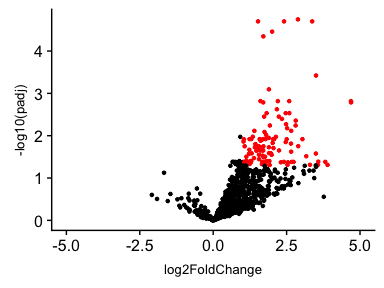
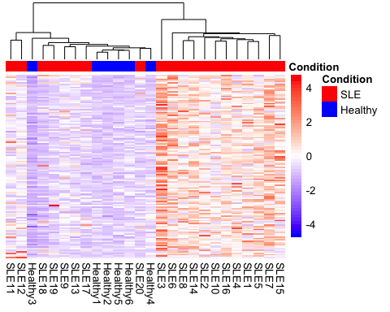

Tokuyama Re-analysis
================
Luis P Iniguez
4/9/2019

Tukuyama M. et al. 2018
=======================

Tukuyama et al. (2018) published ERVmap, an open-source code to analyze transcription of unique sets of human ERVs. The authors also provided a curated list of 3,220 ERV proviral loci, and they included ERV loci with unique chromosomal locations that had been described as autonomous/proviral ERVs. These ERVs were either transcribed in various disease contexts or identified as ERVs based on sequence analysis in silico. The authors proved their method in human cell lines, primary cell types, SLE patients and breast cancer tissues.

Regarding SLE, the authors obtained peripheral blood mononuclear cells (PBMCs) from female SLE patients (20) and healthy (6) females, performed RNA sequencing and analyzed the RNA-seq libraries with ERVmap. They found 124 ERVs that were significantly elevated in SLE patients’ PBMCs compared with healthy controls.

RNA-seq samples from SLE and healthy donors could be found at [NCBI](https://www.ncbi.nlm.nih.gov/sra?linkname=bioproject_sra_all&from_uid=505280). Regarding the samples authors said: "Whole blood collected in heparin tubes were centrifuged to obtained plasma, and the rest of the blood was used to isolate PBMCs using Ficoll-Paque density centrifugation separation \[...\] RNA was isolated according to manufacturer’s protocol (RNeasy kit; Qiagen)\[...\]High-throughput sequencing was performed on the RNA samples using HiSeq and NextSeq Illumina sequencing machines \[...\] Roughly 100 million reads were obtained for each sample using 150-bp pair-end reads"

There is some discrepancy if the RNA-seq was enriched with polyA or if a depletion of ribosomes and total RNA was sequenced. On the [NCBI](https://www.ncbi.nlm.nih.gov/sra?term=SRX5001351) SRA of the samples sais: "PBMCs were obtained from whole blood using Ficoll-Paque and RNA was extracted using an RNeasy Mini Kit (Qiagen). Illumina library preparation kit for polyA RNA". Nevertheless, [RNasy Mini Kit](https://www.qiagen.com/us/shop/sample-technologies/rna/total-rna/rneasy-mini-kit/#productdetails) is a procedure as Qiagen describes: "(that) enriches for RNA species &gt;200 nt, RNA yield does not include 5S rRNA, tRNAs, or other low-molecular-weight RNA". This may be important since there could be a discrepancy of RNA-seq methodology between Cell types samples and the Tukuyama samples. (I am not sure if the Cell types samples are total RNA-seq or poly-A enriched).

Another important issue regarding the samples used is that the sequenced with two different sequencing machines, HiSeq and NextSeq.

| Sample  | HiSeq | NextSeq | Total |
|---------|-------|---------|-------|
| SLE     | 16    | 4       | 20    |
| Healthy | 2     | 4       | 6     |

The authors provide the ERV annotations and for the differential expression analysis they mention: "The read counts are normalized by the size factors obtained from the cellular genes of the same sample, calculated using the DESeq2 normalization method. \[...\] reads were mapped to human genome (GRCh38) by TopHat2 (and) counts of reads for each gene were based on Ensembl annotation. After the counts are collected, DEseq2 was used to calculate size factor for each sample." Normalized counts for genes and ERVs as well as DEseq2 outputs are provided in the [GEO database](https://www.ncbi.nlm.nih.gov/geo/query/acc.cgi?acc=GSE122459).

The authors do not provide the information necessary for reproducing their results, since raw gene counts are mandatory for DESeq analysis. They also do not mention which method from DESeq was used to calculate differential expression. I assumed the authors used default parameters: Wald-test without any adaptive shrinkage estimator and these parameters are used for all DE analysis. Another important issue is that ERVmap could be downloaded but there is no further information about installation, and I could not run it.

Using the information provided in the GEO database I tried to reproduce their figures:

Fig 3A:

Figure 3C is a heatmap about the ERVs differentially expressed, but I could not replicate the figure 100%, for two main motives; first the distance and the hierarchichal clustering methods parameters are not specified and second, it seems the "normalized counts" provided are indeed raw counts (discussed below). I can not normalized the counts because I will need the raw Gene count, which is not provided (discussed below). Nevertheless, I did the heatmap with the raw count data provided.

Figure 3C:

Results can be downloaded [here](https://drive.google.com/drive/folders/1oEBPbkFb6VCnNOPP-w0nW-pGF-wFc52W?usp=sharing)

References
==========

Tokuyama, Maria, Yong Kong, Eric Song, Teshika Jayewickreme, Insoo Kang, and Akiko Iwasaki. 2018. “ERVmap Analysis Reveals Genome-Wide Transcription of Human Endogenous Retroviruses.” *Proceedings of the National Academy of Sciences* 115 (50). National Academy of Sciences: 12565–72. doi:[10.1073/pnas.1814589115](https://doi.org/10.1073/pnas.1814589115).
